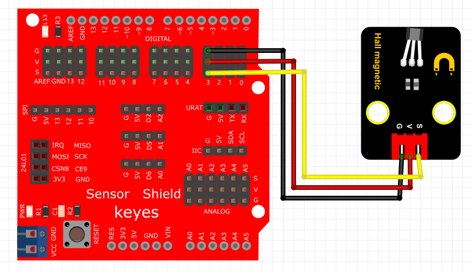

# Arduino


## 1. Arduino简介  

Arduino是一种开源电子原型平台，旨在通过易于使用的硬件和软件帮助用户迅速开发互动项目。自2005年推出以来，Arduino已经成为全球创客、教育者和专业技术人员的热门选择。其主要特点包括：  

- **易于使用**：Arduino提供了用户友好的集成开发环境（IDE）和简单的编程语言，使得编程变得直观，适合初学者。  
- **灵活性**：Arduino支持各种传感器、模块及外设，可以用于构建从简单LED闪烁到复杂机器人项目的各类应用。  
- **社区支持**：Arduino拥有广泛的用户基础和社区支持，提供丰富的学习资料和项目示例，促进了知识分享和技术交流。  

Arduino的多个版本和扩展板使得用户能够根据需求选择合适的硬件，激发他们的创造力并加速原型开发。  

## 2. 连接图  

  

## 3. 测试代码  

```cpp  
int ledPin = 13; // 定义数字口13  
int inputPin = 3; // 定义数字口3  

void setup() {  
    pinMode(ledPin, OUTPUT); // 将ledPin设置为输出  
    pinMode(inputPin, INPUT); // 将inputPin设置为输入  
}  

void loop() {  
    int val = digitalRead(inputPin); // 设置数字变量val，读取到数字口3的数值，并赋值给 val  
    if (val == LOW) { // 当val为低电平时，LED亮起  
        digitalWrite(ledPin, HIGH); // LED亮起  
    } else {  
        digitalWrite(ledPin, LOW); // LED变暗  
    }  
}  
```  

## 4. 测试结果  

按照上图接好线，烧录好代码；上电后，感应到磁铁时，D13灯亮起。  

## 5. 加强训练  

代码：  

```cpp  
int led = 13; // 定义数字口13  
int inputPin = 3; // 定义数字口3  
int x; // 定义变量x  

void setup() {  
    pinMode(led, OUTPUT); // 将led设置为输出  
    pinMode(inputPin, INPUT); // 将inputPin设置为输入  
}  

void loop() {  
    int val = digitalRead(inputPin); // 读取输入口的值  
    if (val == 0) { // 如果值为0  
        x++; // x自增  
        digitalWrite(led, HIGH); // LED灯亮起  
        delay(500); // 延迟0.5秒  
    }  
    if (x == 2) { // 如果x达到2  
        digitalWrite(led, LOW); // LED灯熄灭  
        x = 0; // 重置x  
        delay(500); // 延迟0.5秒  
    }  
}  
```  

结果

上传代码后，感应一次LED灯亮，再感应一次LED灯灭。实现这个功能的关键在于变量x，值得深入思考。


