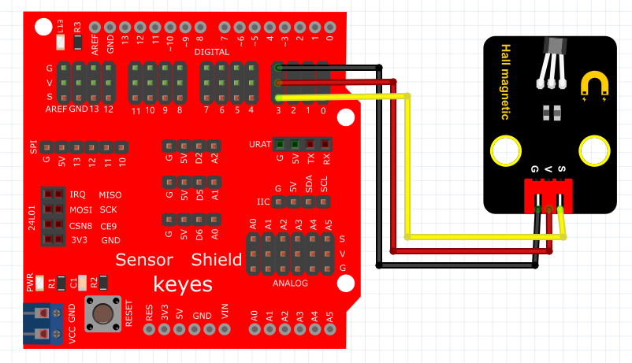

# KidsBlock

## 1. KidsBlock简介  

KidsBlock是一款图形化编程工具，旨在帮助初学者尤其是儿童通过可视化的编程环境进行编程学习。它通过拖放式的模块，使用户能够轻松创建电子项目，省去繁琐的代码书写和语法错误的困扰。KidsBlock支持与Arduino等硬件平台的连接，用户可以通过该平台实际控制硬件，增强学习的趣味性和互动性。该工具适合不同年龄段的学习者，能够有效培养逻辑思维和创造力。  

## 2. 连接图  

  

## 3. 测试代码  

1. 在事件栏拖出Arduino启动模块。  

     

2. 在引脚栏拖出两个设置引脚模式模块，一个设置为引脚3输入，另一个设置为引脚13输出。  

     

3. 在控制栏拖出重复执行模块。  

     

4. 在控制栏拖出判断模块，然后在判断模块里添加运算的等于模块，等于模块的左边添加读取数字引脚3模块，右边为0；满足条件时放第13引脚输出高电平，不满足条件时第13引脚输出低电平。  

     

## 4. 测试结果  

按照上图接好线，烧录好代码，通电后，当感应到磁铁时，LED模块灯亮起。  

结果

上传代码后，当感应一次时LED灯亮起，再感应一次时LED灯熄灭。实现这个功能的关键在于变量time，值得深入思考。

