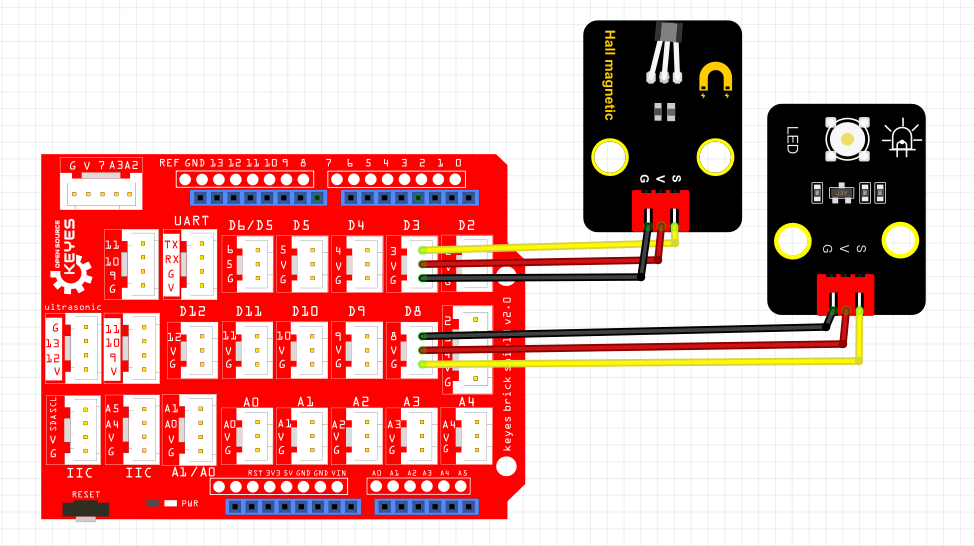

# Python


## 1. Python简介  

Python是一种高级的、解释型的编程语言，由Guido van Rossum于1991年首次发布。它以简洁易读的语法和强大的功能而受到广泛欢迎。Python支持多种编程范式，包括面向对象、函数式和过程式编程。由于其丰富的标准库和强大的社区支持，Python在数据科学、人工智能、网页开发、自动化脚本和嵌入式系统等多个领域得到广泛应用。Python的特点使得它成为初学者和专业开发者的理想选择，学习曲线相对平缓，能够快速入门和加速开发。  

## 2. 连接图  

  

## 3. 测试代码  

```python  
import machine  
import utime  

key = machine.Pin(28, machine.Pin.IN)  # 设置28脚为输入  
led = machine.Pin(25, machine.Pin.OUT)  # 设置25脚为输出  

while True:  
    if key.value() == 0:  # 判断输入是否为高电平  
        led.value(1)  # LED灯亮  
    else:  
        led.value(0)  # LED灯灭  
```  

## 4. 测试结果  

按照上图接好线，烧录好代码；通电后，当感应到磁铁时，LED模块灯亮起。  

## 5. 加强训练  

代码：  

```python  
import machine  
import utime  

key = machine.Pin(28, machine.Pin.IN)  
led = machine.Pin(25, machine.Pin.OUT)  
val = 0  

while True:  
    if key.value() == 0:  
        val += 1  
        led.value(1)  
        utime.sleep_ms(300)  
    elif val >= 2:  
        led.value(0)  
        val = 0  
        utime.sleep_ms(300)  
```  

结果

上传代码后，感应一次LED灯亮起，再感应一次LED灯熄灭。实现这个功能的关键在于变量val，值得深入思考。


